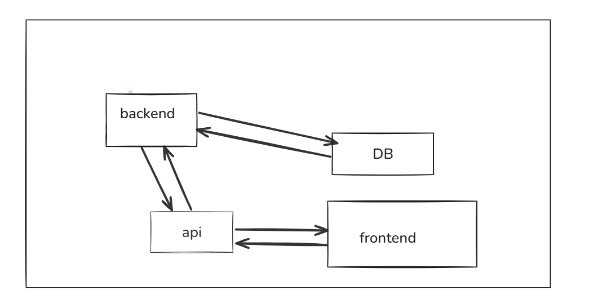
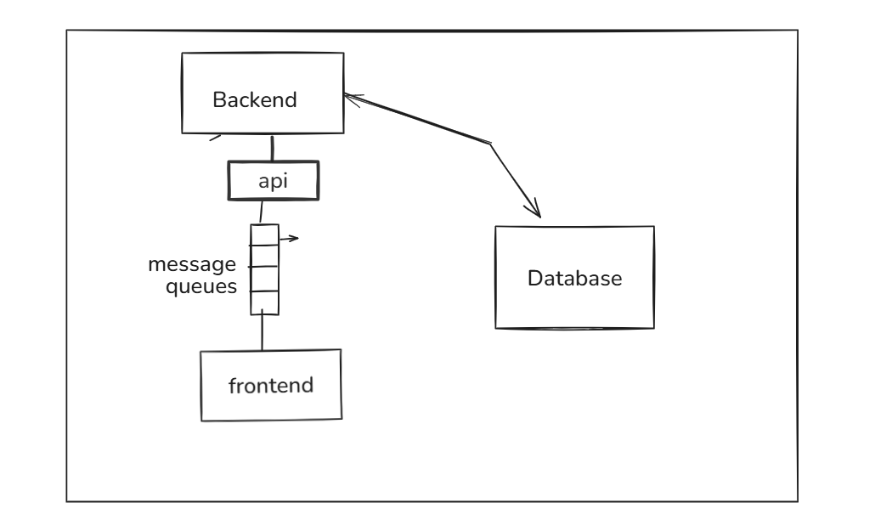

# FrameFusion  

FrameFusion is an AI-powered image generation platform that allows users to create stunning images from text for free. Built to harness the power of state-of-the-art AI models, FrameFusion is designed to inspire creativity and innovation by transforming your text prompts into visually compelling artwork.  

---

## Features  
- **Text-to-Image Generation**: Generate unique and high-quality images directly from descriptive text prompts.  
- **Free Access**: FrameFusion is entirely free to use, ensuring creativity is accessible to everyone.  
- **User-Friendly Interface**: Designed with simplicity in mind, making it easy for anyone to use.  
- **High-Resolution Outputs**: Obtain high-quality image results suitable for various applications.  
- **Diverse Style Options**: Choose from a wide variety of artistic styles to match your creative vision.  

---

## Current Design of the Website  
The current design of FrameFusion is simple yet elegant:  

## Planned System Design  
Here's a high-level diagram of the system architecture we are working on:  

